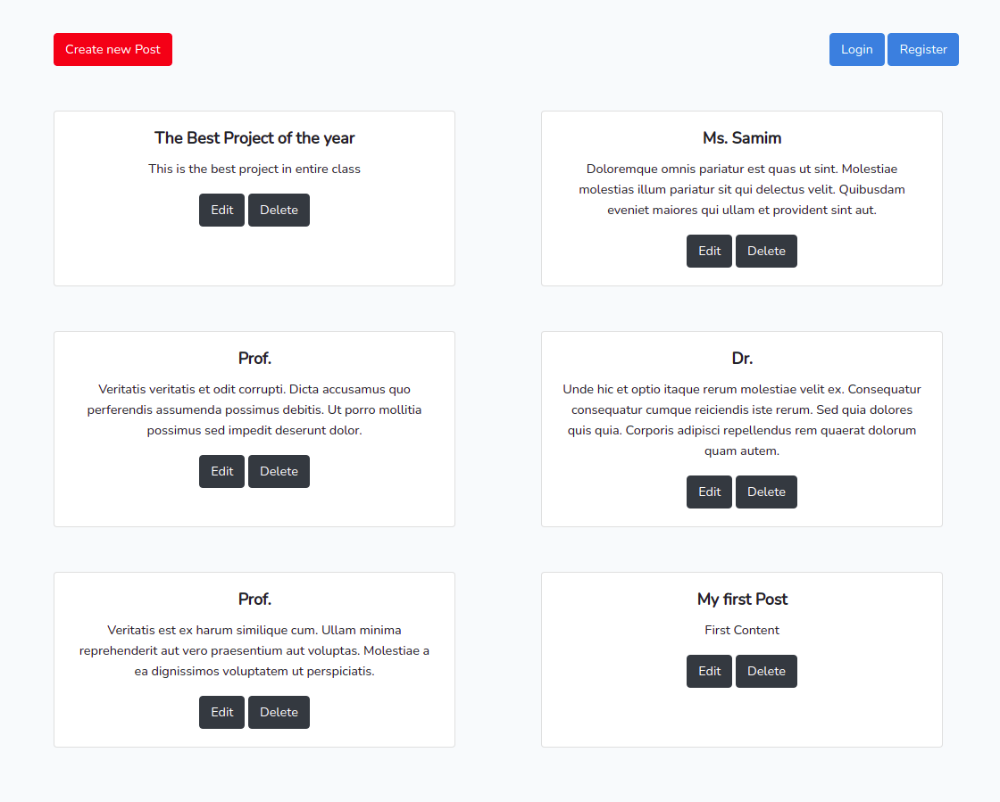
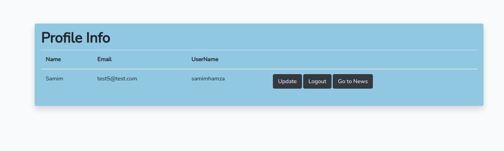
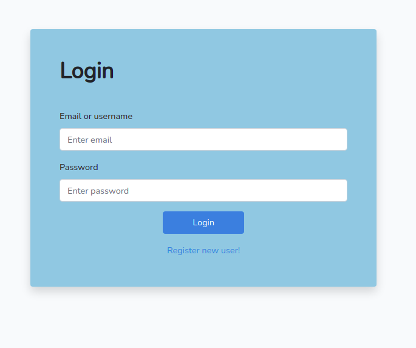
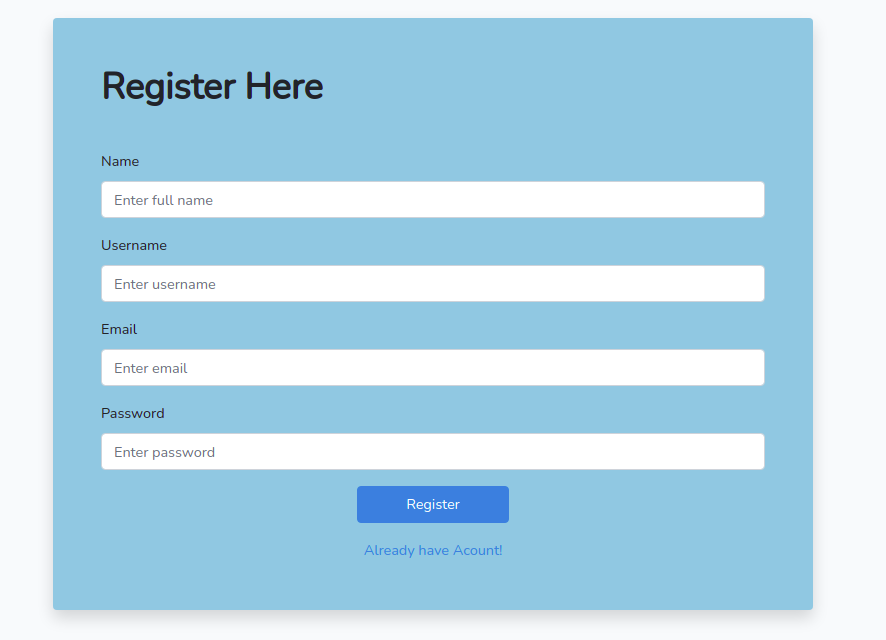
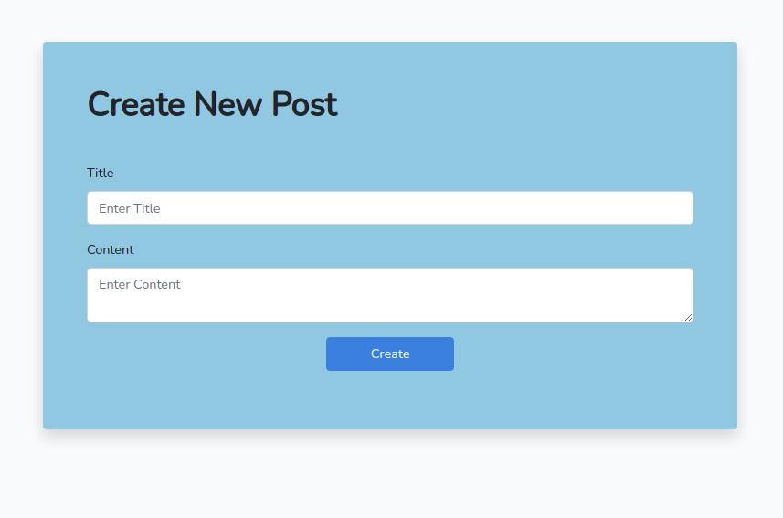
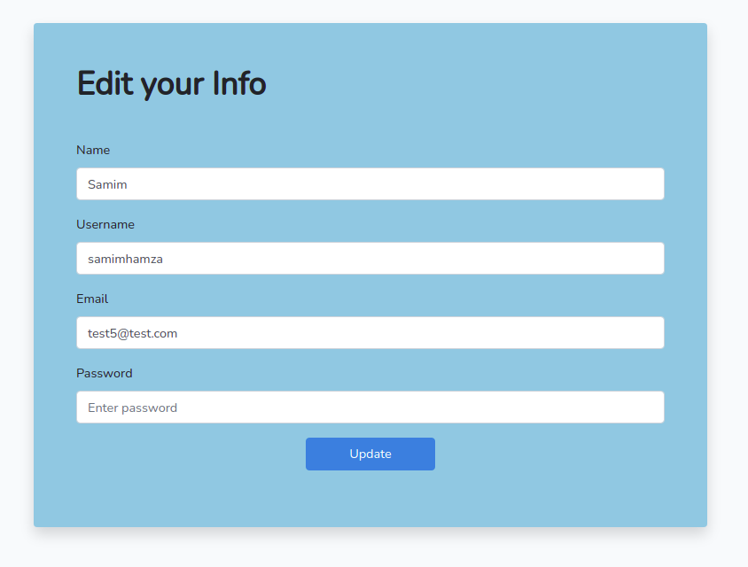
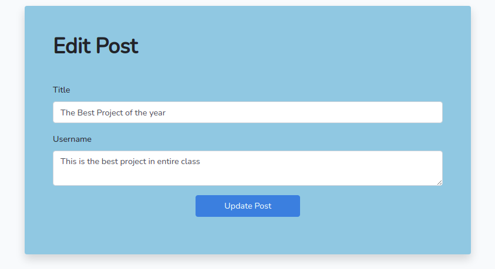

## Mini Homework Project Description
This is a mini project on laravel 8 and MySQL which covers custom login/registration functionalities and CRUD operations.

## First page Contains All The Posts 

</a>

## Profile Page

</a>

## Login/Registration Page

</a>

</a>

## CRUD Operations

</a>

</a>

</a>

